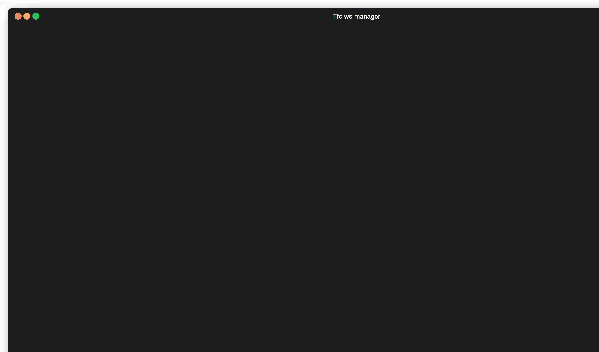

[](https://goreportcard.com/report/github.com/bmv3cg/tf-crud)

Tfc-Workspace-manager
=====================

Terrafrom cloud workspace manager is a command line utility to create, delete, list and update workspaces in [Terraform cloud](http://app.terraform.io). Tfc workspace manager is written in Go lang and uses Hashicrop's go-tfe SDK for managing Terraform cloud workspaces.

Terraform cloud workspace manager provides capablity to manage lifecycle of terrafrom workspaces. You can list all unused workspaces in an oragnisation and sort workspaces according to creation time. Empty workspace list can be ran as a cron job daily to monitor usage and record usage reports. 

Currenlty supported commands. 

- Create workspace
- Delete workspace
- List all workspaces
- List unused workspaces

Installation
------------

You can intall tfc workspace manager using homebrew by adding this [tap](bmv3cg/homebrew-tap). Once tap is configured you can use the brew install command to install the binary.

```bash
brew tap bmv3cg/homebrew-tap
brew install bmv3cg/tap/tfc 
```

Pre-requistes
-------------

Terraform cloud API token is requried for authentciating with Terraform cloud account. You can follow the steps in this [link](https://www.terraform.io/docs/cloud/users-teams-organizations/api-tokens.html#team-api-tokens) to create a token. You can export Terraform token as environment variable and Terraform cloud organsiation to manage workspaces using the following commands. 

```bash 
export TFE_TOKEN="Replace with Terraform cloud token"
export TFE_ORGANISATION="Replace with organisation"
```

Tfc-Workspace-manager usage
---------------------------

You can see all currenlty supported commands of TfC workspace manager in following demo.




Using with Terraform Enterprise
-------------------------------

Terrafrom cloud workspace manager is configured to run with Terraform cloud by default. You can use TFC workspace manager with Terraform enterpise by exporting TFE host environment variable.

```
export TFE_HOST="Replace with Terraform enterpise host"
```